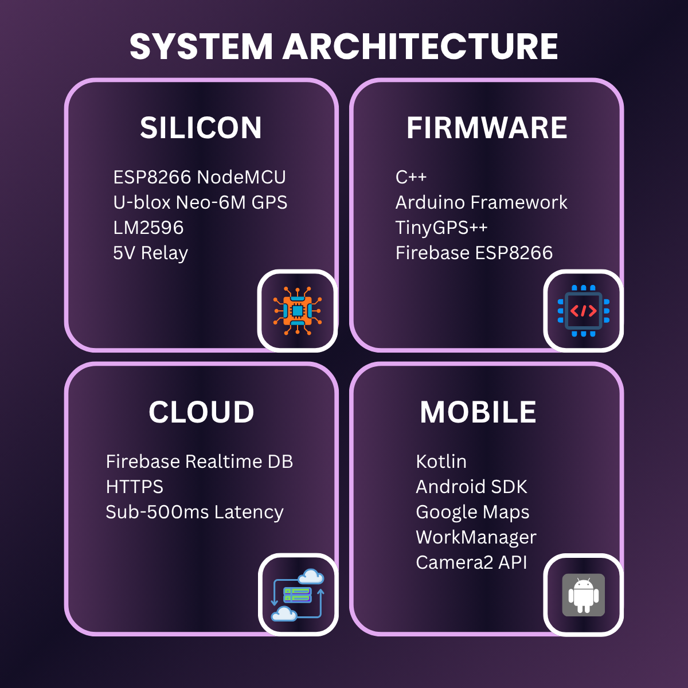
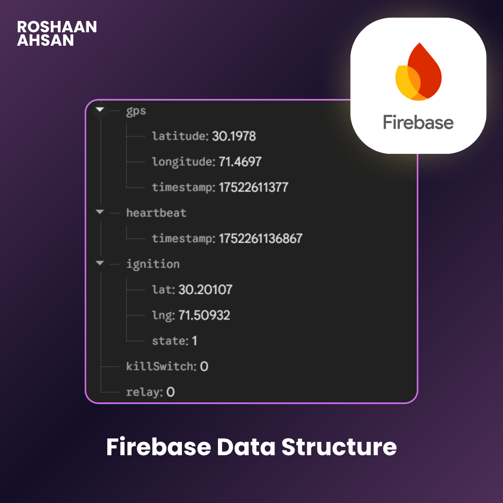
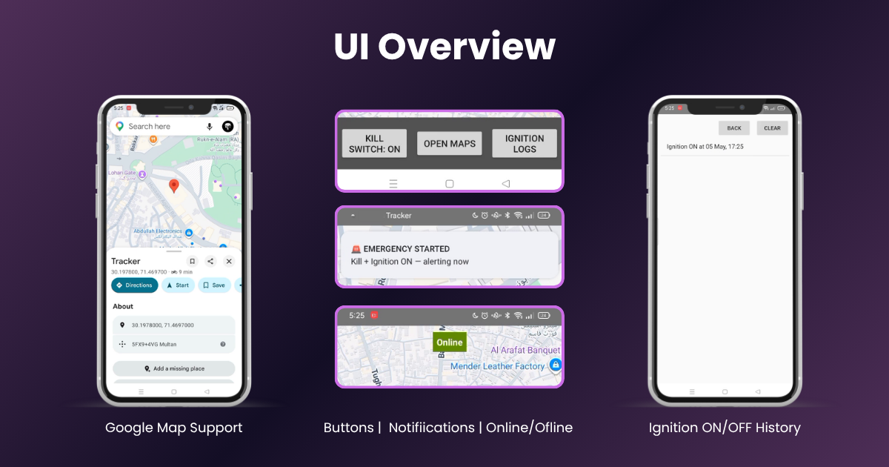

> **Remote engine kill, live GPS tracking, and hardware-level intrusion alarms — wired directly into the car, streamed to your phone in under 500ms.**

---


---

## Executive Summary

Passive vehicle alarms don't stop a determined thief. This is a complete **silicon-to-cloud security system** — from a physical ignition-kill relay wired into the car's ignition circuit, to a Firebase cloud backend, to a custom Kotlin Android application. The owner gets real-time remote control from anywhere: cut the engine in under 500ms, track the vehicle live on Google Maps, and receive a **hardware-level alarm** on their phone the moment an unauthorized start is attempted.

---

## System Architecture



---

## The Problem This Solves

Standard vehicle security is reactive. An alarm sounds, the owner finds out too late, and the car is already gone. This system flips that model entirely:

| Problem | This System's Answer |
|---|---|
| Alarm sounds, thief drives away | Remote kill switch cuts engine before they're gone |
| Location pings only on trigger events | Live GPS coordinates streamed continuously |
| Silent push notification (easy to miss) | Foreground service — screen wakes, strobe fires, phone vibrates |
| Passive, owner has no agency | Active remote control from anywhere in the world |

---

## Technical Stack

### Hardware — Silicon Layer

| Component | Spec | Role |
|---|---|---|
| ESP8266 NodeMCU | Wi-Fi SoC · 80MHz · 3.3V logic | Firmware host · Firebase client |
| U-blox Neo-6M | GPS module · NMEA output | Satellite positioning |
| 5V Single-Channel Relay | Normally Open · 10A rated | Physical engine kill actuator |
| LM2596 Buck Converter | 12V → 3.3V regulated | Safe IGN signal sensing |

### Firmware


### Cloud Backend


Firebase Realtime Database serves as the command bus, state persistence layer, and intrusion flag register between firmware and Android app.

### Android Application


---

## Engineering Deep Dive

### The SIM800L Problem — When a Protocol Conflict Kills a Design

The original architecture called for a SIM800L 2G cellular module. The reason was clean: a standalone cellular connection means no dependency on a phone hotspot. The vehicle is always reachable, anywhere.

The conflict surfaced immediately. **Firebase Realtime Database enforces HTTPS on every connection.** The SIM800L is a 2G module — it speaks HTTP natively. Getting reliable SSL/TLS on a 2G modem at this tier is not a configuration problem; it's a hardware capability problem. 4G modules that support native HTTPS were sourced but were regionally unavailable and cost-prohibitive for this build stage.

**The re-engineered solution:** Pivot to ESP8266 Wi-Fi using an in-car hotspot or OBD dongle.

| Requirement | SIM800L (rejected) | ESP8266 + Wi-Fi (shipped) |
|---|---|---|
| HTTPS / SSL | ✗ Unreliable on 2G | ✓ Native |
| Firebase compatibility | ✗ Blocked | ✓ Full |
| Command latency | ~2–4s over 2G | <500ms over Wi-Fi |
| Carrier dependency | ✓ SIM required | ✗ None |
| Cost | Higher (4G upgrade needed) | Lower |

The constraint forced a better architecture. Wi-Fi latency over a local hotspot is actually faster than 2G cellular for this use case.

---

### The LM2596 Voltage Bridge — Safe Automotive Signal Sensing

The vehicle's ignition wire operates at 12V. The ESP8266's D2 pin is a 3.3V logic input. Direct connection destroys the microcontroller.

The LM2596 buck converter steps the 12V IGN signal down to a stable 3.3V, allowing the firmware to read ignition state as a clean digital `HIGH`/`LOW`. This is more reliable than a resistor voltage divider because the LM2596 **actively regulates** output voltage under load variation — important in an automotive electrical environment where supply voltage fluctuates constantly:

| Engine State | Supply Voltage |
|---|---|
| Engine off | ~12.0V |
| Engine cranking | ~10.5–11V |
| Engine running | ~13.8–14.4V |

A passive divider drifts with this range. The LM2596 does not.

---

### Intrusion Detection Logic

The system defines an intrusion event as: `KillSwitch == ON` **AND** the IGN wire goes `HIGH`.

If the kill switch is armed and someone attempts to start the car anyway, the IGN wire activates. The firmware detects this state transition and writes an intrusion flag to Firebase:

```cpp
void loop() {
  bool ignState  = digitalRead(IGN_PIN);   // LM2596 stepped-down signal
  bool killState = Firebase.getBool(fbdo, "/kill_switch");

  if (killState && ignState) {
    Firebase.setBool(fbdo, "/intrusion_alert", true);
  }
}
```

On the Android side, a Firebase listener watches `/intrusion_alert`. When it flips `true`, the app launches a **Foreground Service**. Foreground Services in Android are not subject to Doze mode or background execution limits — the service runs at full priority, acquires a wake lock, and fires the Camera2 API strobe + continuous vibration. This is not a silent push notification. **The phone becomes a physical alarm.**



---

## Features

### 🔴 Remote Engine Kill Switch

A relay wired to the fuel pump or starter circuit. Toggling it from the app snaps the relay shut in under 500ms. The vehicle will not start — or will cut out immediately if already running.

### 📍 Live GPS Tracking

The Neo-6M outputs NMEA sentences continuously. The firmware parses them with TinyGPS++, extracts latitude and longitude, and pushes coordinates to Firebase. The Android app renders a live marker on a Google Maps SDK map. Tapping **Open Maps** fires a `geo:` intent that hands the coordinates to native Google Maps for full navigation.

### 📋 Ignition Audit Log

Every IGN ON event is timestamped and written with GPS coordinates to a local SQLite database on the device. The log page shows the full history — when the car started and exactly where it was. Persists across app restarts.

### 🚨 Active Intrusion Alarm

A Foreground Service triggered by unauthorized start attempts. Acquires a wake lock, forces the screen awake, fires Camera2 API strobe, and vibrates continuously. Not a push notification — a hardware alarm.

---

## App UI



---

## Project Context

Built in late 2025. Published 2026 as part of an active engineering portfolio.

Built because passive alarms don't stop theft — **active remote control does.**

---

## Contact

**Roshaan Ahsan** — Product Engineer

[](mailto:roshaanahsan.pro@gmail.com)
[](https://linkedin.com/in/roshaanahsan)
[](https://github.com/roshaanahsan)
[](https://x.com/roshaanahsan)
